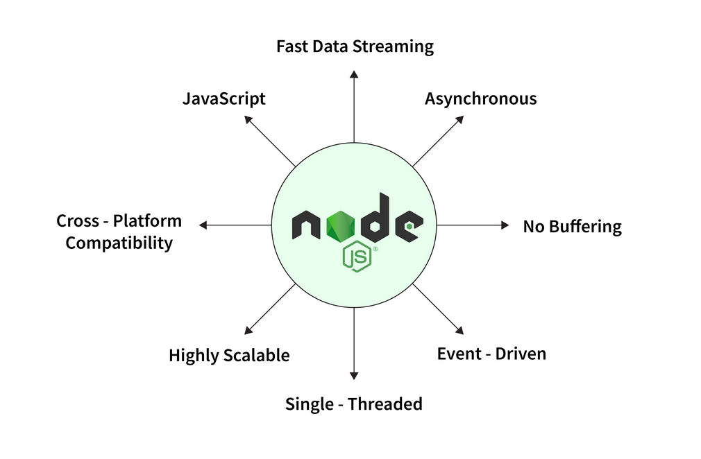
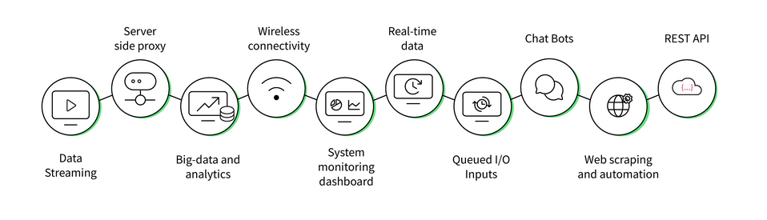

# Node.js

# [1](https://www.scaler.com/topics/nodejs/what-is-node-js/)

## Intro

* Node.js is an open-source framework for building fast and scalable server-side JavaScript applications.

* Built on the V8 JavaScript runtime, it uses an event-driven, non-blocking I/O model, which makes Node.js lightweight, efficient, and ideal for data-intensive concurrent applications on distributed devices.

## Features



1. Single-threaded: In Node.js all requests are single-threaded and collected in an event loop. The event loop is what allows Node.js to perform all non-blocking operations. This means that everything from receiving the request to performing the tasks to sending the response to the client is executed in a single thread. This feature prevents reloading and reduces context switching time.

2. Highly Scalable: Node.js applications are highly scalable because they run asynchronously. Node.js can efficiently handle concurrent requests while balancing all active CPU cores. This feature of Node.js is very beneficial for developers.

3. Cross-Platform Compatibility: Node.js can be used on a wide variety of systems, from Windows to Mac OS, Linux, and even mobile platforms.

5. Fast Data Streaming: Node.js is built on Google Chrome's V8 JavaScript engine, which makes your code run faster. The engine compiles JavaScript code into machine code. This allows Node.js to run significantly faster and provides fast data flow for web applications. Concepts like asynchronous programming and how it works with non-blocking I/O operations make Node.js efficient.

6. No buffering: Node.js works with data streams, which are aggregated data. Therefore, the user can get the data more easily and quickly because there is no need to wait for the entire operation to complete. It reduces the overall time required for processing. Because of this, there is little or no data buffering with Node.js.

7. Asynchronous: Node.js is asynchronous by default i.e. that a server built using Node.js does not need to wait for the date from an API. In other words, Node.js works in a non-blocking way, that does not block the execution of any further operation. Asynchronous and non-blocking I/O improves both response time and user experience.

8. Event-driven: The concept of event-driven is similar to the concept of callback functions in asynchronous programming. In Node.js, callback functions, also known as event handlers, are executed when an event is triggered or completed. Callback functions require fewer resources on the server side and consume less memory. This feature of Node.js makes the application lightweight.

## Useages



1. Data Streaming: Node.js provides strong support for HTTP streaming, which makes Node.js ideal for building live streaming applications such as live sports or news channels that require live updates.

2. Server-side rendering: Server-side HTML rendering is a good idea for websites with mostly static content. Server-side HTML rendering means that Node.js can do all the work before sending the response back to the client, allowing users to view content immediately instead of waiting for node.js to render everything in JavaScript after receiving a request from the client.

4. Command Line Tools: Node.js can be used to build command line tools. While Node is usually associated with websites and web applications, Node.js is also great for building command-line tools and allows you to automate repetitive tasks or build a tool that requires block operations such as a file downloader.

5. Desktop Apps: Node-WebKit is an application runtime environment based on Chromium and Node.js that allows developers to use Node.js as a backend for their desktop programs. Node-WebKit uses a modified version of the Node.js V8 engine, so you can build other types of Chrome apps and not just standalone Node.js apps.

6. Embedded systems: JavaScript was used to program microcontrollers and IoT device prototypes but hardware programming is quickly emerging as a major use case for Node.js. There is now even a port of Node.js with much lower system requirements, called low.js, which allows Node.js to run on low-cost, power-efficient microcontroller boards.

## What is Node.js File?

A Node.js application consists of the following three key steps:

1. Required modules - require directive is used to load the Node.js modules.

```js
const http = require('http');
```

2. Server, requests, and responses - A server that listens to client requests. The server will read the HTTP requests made by the client and returns the required responses. Here, we are creating a server instance by calling the http.createServer() method and connecting to port 1337 using the listen method associated with the server instance.

```js
http.createServer((request, response) => {

    // Status code 200 tells the browser that everything is OK, and the data is in a plain text

    response.writeHead(200, {
        'Content-Type': 'text/plain'
    });

    response.write('Hello, World!\n');

    response.end();

}).listen(1337);
```

3. Testing request and response - Put steps 1 and 2 together in a file called main.js and start the server.

```js
const http = require('http');

http.createServer((request, response) => {

    response.writeHead(200, {
        'Content-Type': 'text/plain'
    });

    response.write('Hello, World!\n');

    response.end();

}).listen(1337);
```

* Start the server by running main.js as follows:

        $ node main.js

        Your HTTP server is running and responding to all HTTP requests on port 1337.


## Node.JS vs Javascript

| Basis Of Comparison |	JavaScript | Node.jS |
| :---: | :---: | :---: |
| Definition | It is an open-source, cross-platform, interpreted, and lightweight programming language used for developing dynamic web applications. | Node.js is an open-source framework for building fast and scalable server-side JavaScript applications. |
| Utility | It is used for client-side activities in web applications, such as validating properties, refreshing the page at regular intervals, or dynamically changing a web page without refreshing the page. | It is used to access non-blocking operations such as writing shell scripts, accessing hardware-specific data, and working with backend jobs |
| Limitations | JavaScript lacks multi-threaded and multi-processor capabilities. | Node.js has to deal with a lot of code changes due to its unstable API. |
| Languages | JavaScript is a high-level, just-in-time compiled language that adheres to the ECMAScript standard. | Node.js is a JavaScript runtime built on Chrome's V8 JavaScript engine. |
|Running Engines | JavaScript can be run in any browser that supports JavaScript engines such as Firefox, Google Chrome, Opera, and Spider Monkey. | Node.js is only supported in Chrome's V8 engine. JavaScript applications written in Node.js always run on Chrome's V8 engine. |
| Modules | Few popular JavaScript frameworks are Angular, React, Vue.js, Ember.js, Meteor, Polymer, etc. | NPM is the default package manager for Node.js. Some of the popular NPM packages include Express, Lodash, Axios, and Molecular. |


# [V8- Engine](https://www.scaler.com/topics/nodejs/v8-engine/)

* js -> machine code
* written in c++
* V8 is an open-source Javascript and WebAssembly engine developed by Google, written in C++.
* V8 uses an interpreter called Ignition which walks through the AST and generates byte code. An interpreter executes each line of bytecode from top to bottom.
* Abstract Syntax Tree (AST) is a way to represent the syntax of a programming language as a hierarchical, tree-like structure.
* V8 engine uses a compiler known as Turbofan which takes bytecode from Ignition, inputs function feedback, applies a set of reductions based on it, and generates machine code.
* Sandboxing refers to a method in which you use an isolated environment or "sandbox" for testing.


## [YARN vs NPM](https://www.scaler.com/topics/nodejs/yarn-vs-npm/)

## [Hello.js program](https://www.scaler.com/topics/nodejs/node-js-hello-world/)

* ./t1/Hello.js
